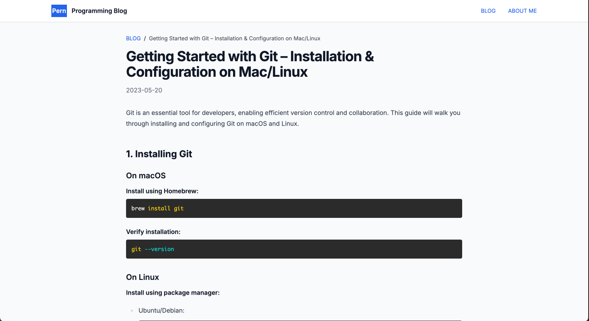

# Modern Programming Blog

A modern, feature-rich programming blog built with Next.js 13+ (App Router), TypeScript, and Tailwind CSS. This blog includes features like markdown content management, syntax highlighting, search functionality, and a modern profile page.

## Features

### Blog Features
- 📝 Markdown-based blog posts
- 🔍 Real-time search functionality with animations
- 🎨 Syntax highlighting for code blocks
- 📱 Fully responsive design
- ⚡ Server-side rendering
- 🔄 Previous/Next post navigation
- 🎯 SEO optimized

### Profile Page Features
- 🎨 Modern card design with gradient background
- 📊 Interactive statistics display
- 🏷️ Skill tags with categories
- 📱 Responsive layout
- ✨ Smooth animations
- 🔗 Social media integration

## Tech Stack

- **Framework:** Next.js 13+ (App Router)
- **Language:** TypeScript
- **Styling:** Tailwind CSS
- **Markdown Processing:** gray-matter, remark, rehype
- **Syntax Highlighting:** rehype-prism-plus
- **Animations:** Framer Motion
- **Icons:** Lucide React

## Getting Started
